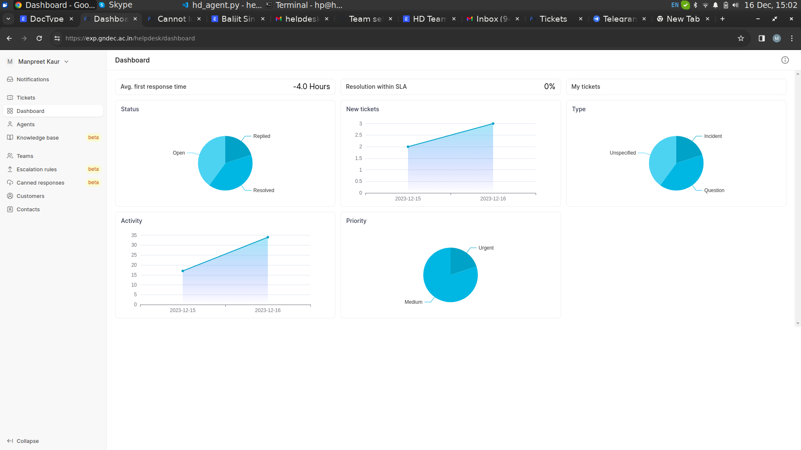

####  Dashboard of help desk




## Status
It show status of tickets . In the helpdesk app  4 status are avaliable. In the image show three status because we have not set ticket status as closed till now.
1. Open
2. Replied
3. Resolved
4. closed

## New Tickets
New tickets show the digital record created by customers or team members with in a date. 

For example yesterday i create 2 tickets it show two and today i create 3 tickets.


## Type
It show the types of tickets. here types are Bug,incident, question, unspecofied.

## Activity
Agents can quickly get up to speed with what’s on their do for the day.

## Priority
It show the priority of tickets. avaliable priorities Medium,Low, High, Urgent.
```sh
In a medium solve the ticket in 3 days.
In a Low solve the tickets in 5 days .
In a High solve the tickets in 2 days.
In a urgent solve the tickets in 2 days.

```
